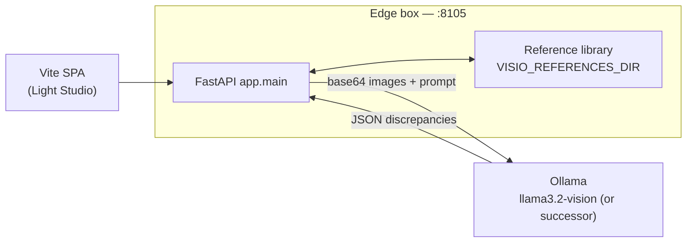
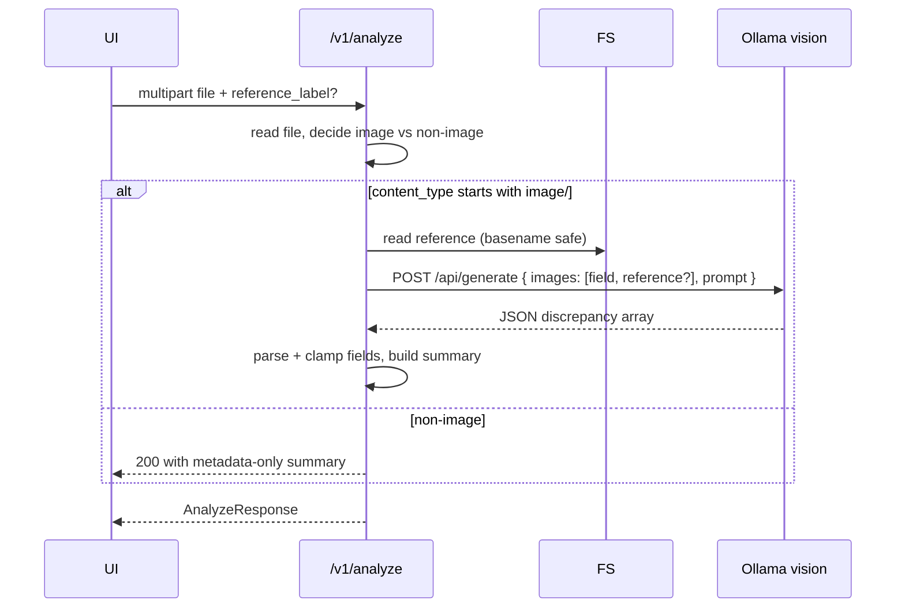
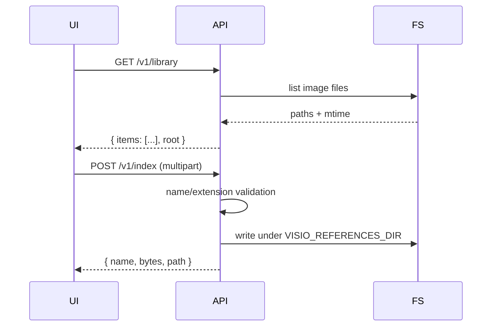

# VisioScan — architecture

## Component diagram

## Analyze sequence

## Library sequence

## Path-safety

Every reference name passes through `_safe_reference_path`:
- rejects `..`, `/`, `\` in label
- coerces to basename only
- resolves against `REFS_ROOT.resolve()` and verifies the result is inside

The upload endpoint applies the same guard via `Path(base).name` + a `relative_to`
check, so a malicious filename cannot escape the references dir.

## Frontend

- **Light Studio** theme: magenta-rose + warm cream, Fraunces editorial,
  JetBrains Mono. Lens flares, aperture motif, polaroid frames for previews.
- Reference picker can use the new `/v1/library` to render a thumbnail strip
  (next iteration — currently the form accepts a `reference_label` typed by the
  technician or selected from presets).
- WCAG: skip-link, reduced-motion (kills polaroid tilt), focus rings, semantic
  landmarks.
